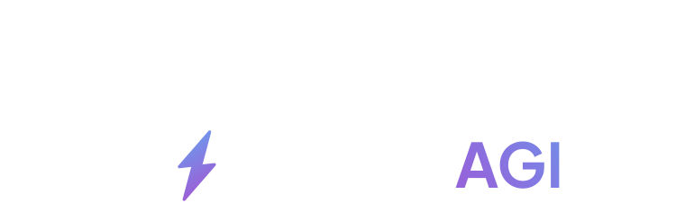

<p align="center">
  <a>
    
  </a>
</p>

# HR-AGI-Tool Repository

Welcome to the HR-AGI-Tool repository! This project aims to revolutionize the way autonomous agents interact with Human Resource tasks. Evaluating a job candidate before a human can reduce working time, and this repository offers a comprehensive solution to streamline and enhance this process.

Thanks to [lablab.ai](https://lablab.ai) and [SuperAGI](https://lablab.ai/tech/superagi) we joined [this hackathon](https://lablab.ai/event/autonomous-agents-hackathon) to push the boundaries of innovation and leverage cutting-edge Autonomous AI Agents such as SuperAGI :)

## Collaborators (Team AGI Gods)

[](https://github.com/gajojr) [](https://github.com/Scripter802) [](https://github.com/uros-mijajlovic) [](https://github.com/kecoje)

---

## Project Overview

The HR-AGI-Tool project is dedicated to pioneering a new era of efficiency and effectiveness in the realm of Human Resource tasks. Traditional methods of candidate evaluation often involve time-consuming and resource-intensive processes that can lead to delays in hiring decisions. However, our solution harnesses the power of Artificial General Intelligence (AGI) to automate and optimize various aspects of this process.

## Key Features

Autonomous Candidate Evaluation: The heart of this project lies in its ability to autonomously evaluate job candidates. Leveraging advanced algorithms and AI techniques, the HR-AGI-Tool can assess candidates' qualifications, skills, and compatibility with company requirements.

- Time Reduction: By automating the initial stages of candidate evaluation, the repository drastically cuts down the time required to identify suitable candidates. This leads to quicker hiring cycles and ensures that talented individuals are not left undiscovered.

- Comprehensive Solution: The repository provides a holistic solution encompassing data preprocessing, candidate profiling, skill matching, and preliminary interviews. This end-to-end approach streamlines the HR workflow and minimizes the need for manual intervention.

## How to Use

To take advantage of the HR-AGI-Tool's capabilities, follow these steps:

1. Clone the Repository: Begin by cloning this repository to your local machine using the following command:

```
git clone https://github.com/kecoje/hr-agi-tool.git
```

2. Install Dependencies: Navigate to the repository directory and install the necessary dependencies by running:

```
npm install
```

3. Environmet setup: Create a file named .env in the root of the project with theese environmental variables:

```
OPENAI_API_ORG = <YOUR-OPENAI-ORGANIZATION-ID>
OPENAI_API_KEY = <YOUR-OPENAI-API-KEY>
NODE_ENV = development

```

4. Data Preparation: Prepare the candidate data (pdf file) and job data (job description)

5. Run the AGI Tool: Execute the demo server and client:

```
npm run dev
```

6. Review Results: Once the tool completes its evaluation, review the generated candidate reports in the designated output directory. These reports contain valuable insights that can aid in the decision-making process.

## Contributions and Feedback

We welcome contributions from the community to enhance and expand the capabilities of the HR-AGI-Tool. If you have ideas for improvement or would like to report issues, please feel free to open an issue or submit a pull request.

## License

This project is licensed under the [MIT License](https://opensource.org/license/mit/), which allows for open collaboration and adaptation.

Join us in revolutionizing the HR landscape with the power of AGI. Happy candidate hunting!
